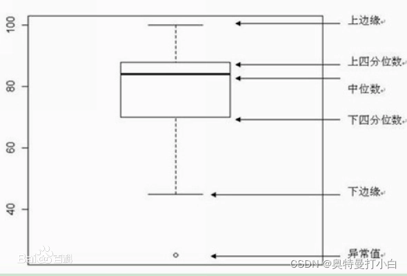
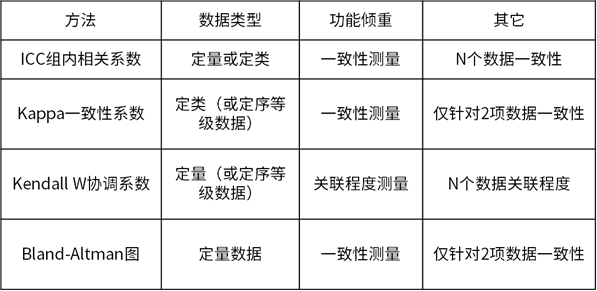

# 数学建模竞赛中关于数据分析题的一些小小总结

本人桂电数学专业，参加过很多次数学建模竞赛，下面是关于数据分析题的一些小小总结

_学习方法 的 ==使用前提（适用条件）==，==作用==？==优缺点==？==怎么用==？_

# 数据处理-pandas

## 0、基本知识

- 1、数据的类型、分布特征
- 2、总体与样本
- 3、参数和统计量
- 4、变量、特征

### 数据的类型、分布特征

分类数据和顺序数据说明的是事物的品质特征，通常用文字来表述的结果表现的都是类别，都可称为定性数据或者品质数据（qualitative data）

数值型数据说明的是现象的数量特征，通常是用数值来表现的，因此称为定量数据或数量数据(quantitative data)。

区分数据类型的意义：区分不同类型的数据采用不同的统计方法来处理和分析。
如：
1、分类数据我们通常计算各组的频数、众数、异众比率，进行列联表分析和卡方检验等；

2、顺序数据可计算中位数和四分位差以及等级相关系数等；

3、数值型数据可计算更多统计量、进行参数估计和假设检验等。

## 1、数据读取与保存

## 2、数据信息查看

### 1、数据的特征的类型

### 2、数据的大小

## 3、数据的描述性分析

**\*数据分析**所用的方法可以分为**描述统计方法**和**推断统计方法**。\*

描述统计：研究的是数据收集、处理、汇总、图表描述、概括与分析等统计方法。

推断统计：是研究如何利用样本数据来推断总体特征的统计方法。
比如：要了解一个地区的人工特征，不可能对每个人的特征一一测量，这种情况下就需要抽取部分个体样本进行测量，然后与根据所获得的样本数据对所研究的总体特征进行推断，这就是推断统计要解决的问题。

描述统计分析
即对调查总体所有变量的有关数据进行统计性描述，简单来说就是将一系列复杂的数据集用几个有代表性的数据进行描述，进而能够直观的解释数据的变动，主要包括数据的离散程度分析、集中趋势分析、频数分析、分布以及一些基本的统计图形。

**==参考链接==**

[数据分析-描述性分析 - 知乎 (zhihu.com)](https://zhuanlan.zhihu.com/p/144046529)

[数据基本描述之描述性分析 - 知乎 (zhihu.com)](https://zhuanlan.zhihu.com/p/64967217)

- 1、频数分析
- 2、列联表（交叉）分析
- 3、描述性统计
- 4、分类汇总
- 5、正态性检验
- 注意事项

### 3、描述性统计

- **描述性统计分析常用指标**
- - 一是分布的集中趋势，反应各数据向其中心值聚集的程度；

    - 二是分布的离散程度，反应数据远离中心值的趋势；
    - 三是分布的形状，反映数据分布的偏态和峰态

      1.反应集中趋势的指标：众数、中位数和分位数、平均数
      1.1 众数(mode)：一组数据中出现次数最多的变量

特点：具有不唯一性，一组数据可能有多个众数，也有可能没有众数

应用：数据量多的较多时才有意义，主要适合分类数据的集中趋势测度值

1.2 中位数(median)：一组数据排序后处于中间位置上的变量值
计算公式：中位数位置=(n+1)/2,式中，n 为数据个数；
当 n 为奇数时，Me=在(n+1)/2 位置上的数，
当 n 为偶数时，Me=[在(n/2）位置上的数+在(n/2）+1 位置上的数]/2

特点：不受数据极端值的影响，

应用：数据分布偏斜程度大时适合使用，主要适合顺序数据的集中趋势测度值

1.3 四分位数(quartile)：一组数据排序后处于 25%和 75%位置上的值，也就是用 3 个点将全部数据 4 部分，每部分包含 25%的数据。中间的四分位数就是中位数，因此通常所说的四分位数是指处在 25%位置上的数值（称为下四分位数 Q1）和处在 75%位置上的数值（称为上四分位数 Q3)

计算公式：
四分位数位置的确定方法有多种，每种方法结果会有点差异，差异不大，如下介绍其中一种。
按照定义，四分位数位置确定方法步骤如下：
a.首先对一组数据排序,
b.Q1=n/4 位置，Q2=2n/4=n/2 位置, Q3 位置=3n/4
c.如果位置是整数，四分位数就是该位置对应的值；
如果位置在 0.5 的位置，则取该位置两侧值的平均数；
如果位置在 0.25 或者 0.75 的位置，则取该位置下侧值加上按比例分摊位置两侧数值的差值；

箱线图（box plot）：是由一组数据的最大值、最小值、中位数、两个四分位数这五个特征值绘制而成的,是一种用作显示一组数据分散情况资料的统计图。它主要用于反映原始数据分布的特征，还可以进行多组数据分布特征的比较。

### 注意事项

1、一般采用平均值加标准差来描述数据的整体情况。

2、当数据呈现严重偏态时，采用中位数描述数据的整体水平情况，而不是平均值。

3、除了使用描述性分析外，也建议使用箱线图直观展示数据分布情况。

## 4、数据的清洗

### 1、重复记录与重复特征

1，读入数据后，使用 df.info()可以查看读取数据的部分信息，包含数据样本规模，每列特征类型与个数，整体的内存占用。

2，利用 df.describe()可以查看数值特征的统计结果，包含数据个数，均值，标准差，最大值，最小值等。

3，df.drop_duplicates()方法可以去除重复数据。(可以通过设置 subset='列名')指定考虑某一列的重复情况，别的全部舍弃。

### 2、缺失值分析与处理

1，Pandas 中，缺失值一般用 NaN 表示，可以使用 df.isnull()查看缺失值情况。

2，df.fillna()可以对缺失值进行填充，括号中可以指定参数，一般为均值 or 中位数。

### 3、异常值查找与处理

1, 使用 3σ 准则检测异常值,又叫拉依达原则，它是指假设一组检测数据中只含有随机误差，需要对其进行计算得到标准偏差，按一定概率确定一个区间，对于超过这个区间的误差，就不属于随机误差而是粗大误差，需要将含有该误差的数据进行剔除。所以我们初学者，就可以简单粗暴的认为，游离在大部队之外的，误差超过（μ-3σ, μ+3σ）区间的数值，都是异常值。

2，绘制箱线图（我国赛就是用的这个方法，巨好用）。

## 5、数据的合并与连接

## 6、分组聚合操作

### grouped 函数的使用

# 数据的可视化（Python）

## 1、Matplotlib 绘制

## 2、Seaborn 绘制

# 数据建模

## 1、多元统计模型

- 1、回归模型
- 2、分类模型
- 3、聚类模型
- 4、因子分析、对应分析、典型相关分析

### 1、回归模型

### 2、分类模型

### 3、聚类模型

## 2、机器学习模型

[scikit-learn 中文社区](https://scikit-learn.org.cn/)

- 1、回归模型
- 2、分类模型
- 3、聚类模型

### 1、回归模型

1、多元线性回归(sklearn.linear_model 中的 LinearRegression 求解)

2、岭回归(使用同一个包中的 Ridge，RidgeCV 进行求解)

3、LASSO 回归，改进版的最小二乘法，与岭回归有一些类似。(Lasso,LassoCV 求解)

### 2、分类模型

- 1、逻辑回归（二分类、多分类）

1、Logistic 回归(statsmodels.api.sm.Logit 求解 or sklearn.linear_model 中的 LogisticRegression 求解)

2、普通最小二乘回归(statsmodels.api.sm.OLS 求解)

- 2、决策树

利用 sklearn 求解决策树有两类，一类是 DecisionTreeClassifier(分类决策树)，一类是 DecisionTreeRegressor(回归树)。

- 3、支持向量机

考虑到几个相关的概念，核函数，松弛因子。使用 SVC 求解。

- 4、随机森林

sklearn.ensemble.RandomForestRegressor 求解。这个模型还会涉及到剪枝操作。以及确定树的大小，深度等。

- 5、朴素叶贝斯

注重先验。可以使用 sklearn.naive_bayes.MultinomiaINB 求解

- 6、bp 神经网络
- 7、多层感知机

多层感知机(MLP)其实也叫做人工神经网络。深度学习里面的各种网络都是基于此的发展和改进。和 Bp 神经网络也有些相似之处，不过 MLP 里面都是全连接层，没有别的更多的操作。

- 8、k 邻近（KNN）

sklearn.neighbors.KNeighborsClassifier 求解。(物以类聚人以群分)

- 9、XGBoost

集成学习的一种。底层还是基于决策树。

- 10、LightGBM

### 3、聚类模型

- 1，层次聚类
- 2，K-means 聚类
- 3，DBSCAN 聚类

## 3、医学模型

- 1、卡方检验
- - 1、Pearson 卡方检验
  - 2、Yates 校正卡方检验
  - 3、Fisher 精确检验
  - 4、分层卡方检验
  - 5、配对卡方检验
- 2、生存分析

- 3、一致性检验
- - 
